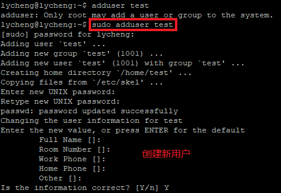
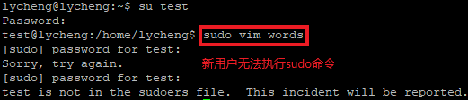
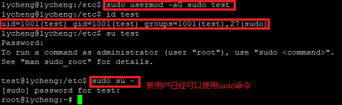
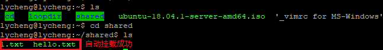
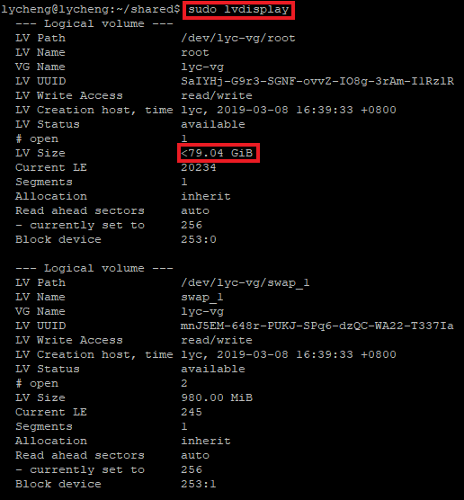
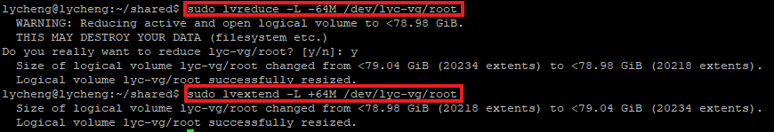
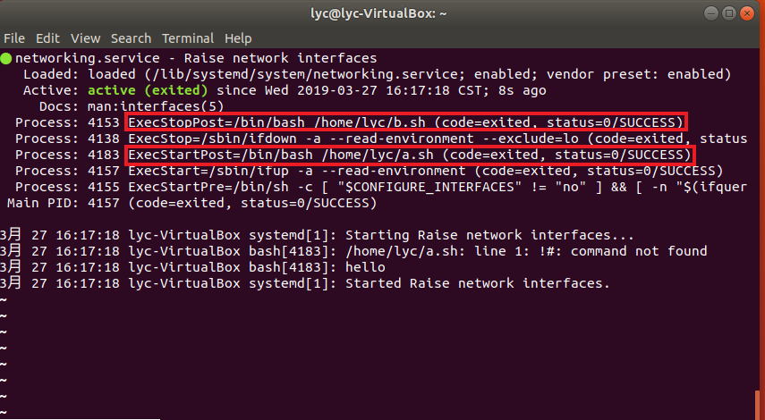

# 实验三 SYSTEM ADMINISTRATOR IS ROOT

## 实验目标

- [x] 动手实战SYSTEMD

- [x] 自查清单

## 实验环境

- VirtualBox

- ubuntu-18.04.1-server-amd64

- ubuntu-18.04.2-desktop-amd64

## 实战SYSTEMD操作录像

- Systemd 入门教程：命令篇

    - [第一、二、三节学习视频](https://asciinema.org/a/S4jqNgHELkzyn0jqDKXFZ5CfF)

    - [第四节学习视频](https://asciinema.org/a/TpuAx7ut3RRwQIt1Yh4sNDmKr)

    - [第五节学习视频](https://asciinema.org/a/2TzTV9n8CjgpMvBd0Jq55ln3K)

    - [第六节学习视频](https://asciinema.org/a/CLDFaYG63zokXyVFjWAQlPlYG)

    - [第七节学习视频](https://asciinema.org/a/9UorOhAnSzKuKUUwo4uSp2X2F)

- Systemd 入门教程：实战篇

    - [第一、二、三节学习视频](https://asciinema.org/a/wYYfhEP1wnJtI3vzGkarniiW2)

    - [第四、五、六、七节学习视频](https://asciinema.org/a/KW4y1aBt8jFmnWjhhVuBsUVMu)

    - [第八、九节学习视频](https://asciinema.org/a/xVWzCgiQaUSEKGKnhylBbFhz5)

## 自查清单

1. 如何添加一个用户并使其具备sudo执行程序的权限？

        # 添加一个用户
        # sudo adduser username
        sudo adduser test
    
        # 切换到该用户
        # su username
        su test
    
        # 无法执行sudo
        sudo vim words
    
        # 退出
        exit
    
        # 添加用户到sudo组
        # sudo usermode -aG groupname username
        # -a, --append                  append the user to the supplemental GROUPS mentioned by the -G option without removing him/her from other groups
        #  -G, --groups GROUPS           new list of supplementary GROUPS
        sudo usermod -aG sudo test
    
        # 添加完后，切换到该用户
        su test
    
        # 此时已经可以执行sudo
        sudo su -

2. 如何将一个用户添加到一个用户组？

        sudo usermode -aG groupname username

3. 如何查看当前系统的分区表和文件系统详细信息？

        # 查看当前系统的分区表
        sudo fdisk -l
    
        # 查看文件系统详细信息
        df -a

4. 如何实现开机自动挂载Virtualbox的共享目录分区？

    `VirtualBox`中选择`设置`->`共享文件夹`->`添加共享文件夹`，选择要和虚拟机共享的文件夹，并勾选`自动挂载`和`固定分配`

        # 在虚拟机内进行相关设置
    
        # 创建挂载目录
        mkdir ~/shared
    
        # 挂载文件夹
        sudo mount -t vboxsf vbshare ~/shared
    
        # 修改配置
        sudo vim /etc/fstab
    
        # 配置内容如下
        vbshare /home/lycheng/shared vboxsf defaults 0 0
    
        # 重启
        reboot

5. 基于LVM（逻辑分卷管理）的分区如何实现动态扩容和缩减容量？

        # 显示逻辑卷信息
        sudo lvdisplay
    
        # 扩容
        sudo lvextend -L +64M /dev/lyc-vg/root
    
        # 缩容
        sudo lvreduce -L -64M /dev/lyc-vg/root

6. 如何通过systemd设置实现在网络连通时运行一个指定脚本，在网络断开时运行另一个脚本？

- ubuntu-18.04.1-server-amd64

    - 查了相关资料，提示应该通过修改`networking.service`实现

    - 运行`systemctl status networking`，系统提示`Unit netwoking.service could not be found.`。查看了`/lib/systemd/system/`和`/etc/systemd/system/`也没发现`networking.service`

    - （推测）在`/lib/systemd/system/`下的`systemd-networkd.service`添加`ExecStartPost=/bin/bash 脚本路径`和`ExecStopPost=/bin/bash 脚本路径`

    - 尝试了很多次后没有成功，提示`(code=exited, status=126)`，查询后以为是脚本权限不足，但对脚本进行了提权仍报错

- ubuntu-18.04.2-desktop-amd64

    - 在该版本下查询后发现有`networking.service`

    - 在`networking.service`添加`ExecStartPost=/bin/bash 脚本路径`和`ExecStopPost=/bin/bash 脚本路径`

    - 成功在网络服务运行和断开时运行了指定脚本

7. 如何通过systemd设置实现一个脚本在任何情况下被杀死之后会立即重新启动？实现杀不死？

    编写相关的`.service`文件，在文件中的`Service`区块处增加`Restart=always`即可

## 遇到的问题

- 创建挂载目录完毕后，运行`sudo mount -t vboxsf vbshare ~/shared`报错。

    - 解决办法：运行`sudo apt-get install virtualbox-guest-utils`

## 参考资料

- [LVM](https://wiki.ubuntu.com/Lvm)

- [How to mount a VirtualBox shared folder at startup?](https://askubuntu.com/questions/252853/how-to-mount-a-virtualbox-shared-folder-at-startup)